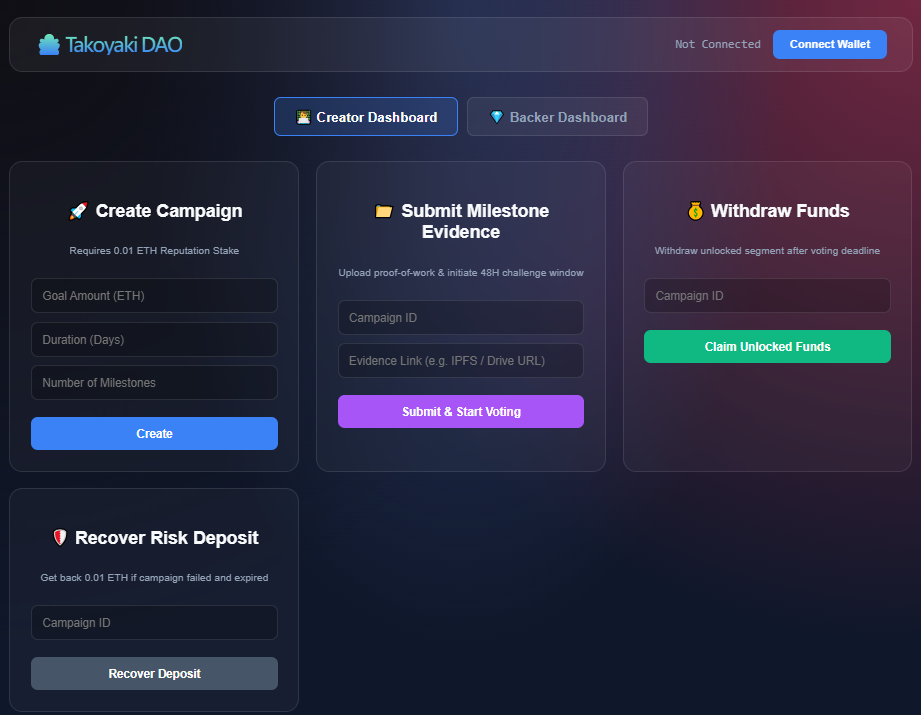
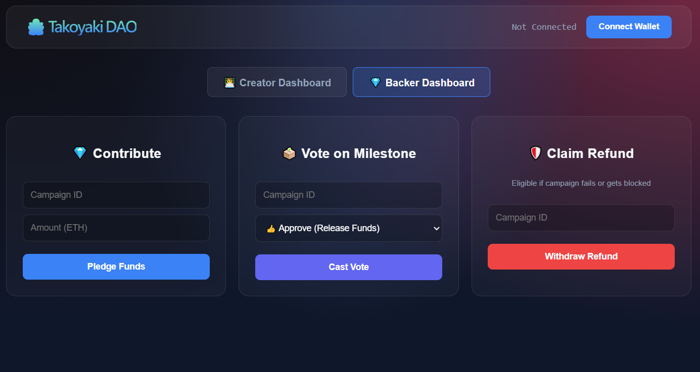
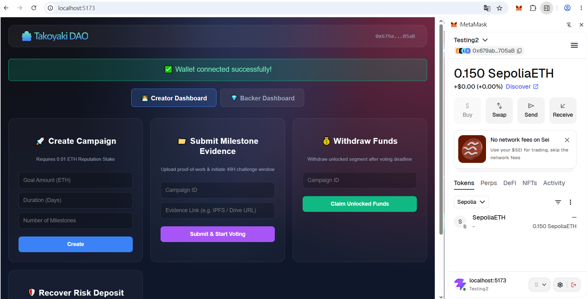

Markdown

# Tako Crowdfunding dApp 🐙

This is a decentralized crowdfunding platform (dApp) built on Ethereum. The project follows a Monorepo structure, organizing the smart contract backend and the React frontend into a unified repository.

- **Smart Contract Framework:** Hardhat 3 (ESM Mode)
- **Frontend Framework:** React + Vite + Ethers.js

---

## 📂 Project Structure

```text
tako-dapp-contract/
├── contracts/          # Solidity smart contract source files
├── scripts/            # Deployment scripts
├── test/               # Smart contract unit test files
├── frontend/           # React + Vite frontend web application
├── images/             # UI Screenshots for documentation
│   ├── CreatorDashboard.png
│   ├── BackerDashboard.png
│   ├── ActiveVoting.png
│   └── WalletSuccess.png
├── hardhat.config.ts   # Hardhat configuration file
└── README.md           # This instruction document
```

🛠️ Prerequisites

Before running this project, ensure you have the following installed on your machine:

    Node.js (v18 or higher recommended)

    Git

🧠 Backend: Contract Compilation, Testing, and Deployment

Open your terminal, ensure you are in the root directory (tako-dapp-contract), and install the backend dependencies:

npm install

1. Compile the Contracts

Compile the Solidity smart contracts and generate the required ABIs:

npx hardhat compile

Upon successful compilation, the artifacts/ and cache/ directories will be generated in the root.
2. Run Unit Tests

Execute the automated test scripts to verify the smart contract logic:

npx hardhat test

3. Deploy to Local Network

To run the dApp locally, follow these two steps in order:

Step A: Start the local virtual blockchain node

npx hardhat node

Keep this terminal window open. The node will run at http://127.0.0.1:8545.

Step B: Open a new terminal window/tab and run the deployment script

npx hardhat run scripts/deploy.ts --network localhost

Once successfully deployed, the terminal will display the 📍 Contract Address.
🎨 Frontend: Web Application Setup

Switch to the frontend directory and install the necessary web packages:

cd frontend
npm install

1. Configure Environment Variables (CRUCIAL STEP)

Before starting the frontend server, you must link it to your newly deployed smart contract. The application is natively designed for the Sepolia testnet, but the following configuration will route it to your local environment for testing purposes.

Create a new file named .env inside the frontend/ directory and add the following lines:

VITE_CHAIN_ID="0x7a69"
VITE_CONTRACT_ADDRESS="YOUR_NEWLY_DEPLOYED_ADDRESS"

(Note: Replace YOUR_NEWLY_DEPLOYED_ADDRESS with the exact Contract Address printed in your terminal during the backend deployment).
2. Start the Local Development Server

Run the following command to boot up the Vite development server:

npm run dev

3. Browse the Web Application

Once the server is running, open the local URL in your web browser:

http://localhost:5173/

The web interface will now render. Make sure the MetaMask is connected to the appropriate network to interact with the smart contracts.

### 📸 UI Preview








### Manual Testing Flow: Successful Campaign Lifecycle

**The Actors (MetaMask Accounts)**
For this test, use three separate accounts from your local Hardhat node or the Sepolia testnet:
* **Account 1 (Creator):** The person starting the project.
* **Account 2 (Backer A):** A supporter with funds.
* **Account 3 (Backer B):** Another supporter.

---

#### Step 1: Create the Campaign
* **Active Actor:** Switch MetaMask to Account 1 (Creator).
* **Action:** Click the Connect Wallet button at the top right of the page.
* **Tab:** Go to the Creator Dashboard.
* **Form:** Navigate to the Create Campaign card.
* **Enter these exact inputs:**
  * **Goal Amount (ETH):** `10`
  * **Duration (Days):** `7`
  * **Number of Milestones (Limit: 1 to 10):** `2`
* **Execute:** Click Create. 
* **What happens:** MetaMask will pop up and charge you the `0.01` ETH Reputation Stake. Click Confirm. Once verified, you will see a transaction successful alert. Your Campaign ID is now `1`.

#### Step 2: First Backer Pledges Funds
* **Active Actor:** Switch MetaMask to Account 2 (Backer A) and connect to the dApp.
* **Tab:** Go to the Backer Dashboard.
* **Form:** Navigate to the Contribute card.
* **Enter these exact inputs:**
  * **Campaign ID:** `1`
  * **Amount (ETH):** `6`
* **Execute:** Click Pledge Funds and confirm the transaction in MetaMask.

#### Step 3: Second Backer Pledges Funds (Goal Met)
* **Active Actor:** Switch MetaMask to Account 3 (Backer B) and connect to the dApp.
* **Tab:** Go to the Backer Dashboard.
* **Form:** Navigate to the Contribute card.
* **Enter these exact inputs:**
  * **Campaign ID:** `1`
  * **Amount (ETH):** `4` (Bringing the total raised to 10/10 ETH)
* **Execute:** Click Pledge Funds and confirm the transaction in MetaMask.

#### Step 4: Submit Evidence for Milestone 1
* **Active Actor:** Switch MetaMask back to Account 1 (Creator).
* **Tab:** Go to the Creator Dashboard.
* **Form:** Navigate to Submit Milestone Evidence.
* **Enter these exact inputs:**
  * **Campaign ID:** `1`
  * **Evidence Link (Can be any random string):** `https://ipfs.io/ipfs/QmFirstMilestoneProof`
* **Execute:** Click Submit & Start Voting. This locks the campaign into a 48-hour voting challenge window.

#### Step 5: Backers Vote to Release Milestone 1 Funds
* **Active Actor:** Switch to Account 2 (Backer A).
* **Tab:** Go to the Backer Dashboard.
* **Form:** Navigate to Vote on Milestone.
* **Enter these exact inputs:**
  * **Campaign ID:** `1`
  * **Decision Dropdown:** Select Approve (Release Funds)
* **Execute:** Click Cast Vote and confirm the transaction.
* **Next:** Switch to Account 3 (Backer B) and repeat this exact voting step so both backers approve.

#### Step 6: Claim Milestone 1 Payout
* **Important Wait Time:** The smart contract requires exactly 48 hours to pass after evidence submission before funds can be released. After 48 hours have passed, proceed with the following:
* **Active Actor:** Switch MetaMask back to Account 1 (Creator).
* **Tab:** Go to the Creator Dashboard.
* **Form:** Navigate to Withdraw Funds.
* **Enter these exact inputs:**
  * **Campaign ID:** `1`
* **Execute:** Click Claim Unlocked Funds and confirm the transaction.
* **Result:** The contract calculates the split, cuts a fee for the platform address, and payouts the remaining portion directly to Account 1's wallet. 

> **Note:** To finish the whole success cycle, repeat Steps 4, 5, and 6 one more time for Milestone 2. On that final payout, the contract will return the original 0.01 ETH reputation stake back to the creator.
=======